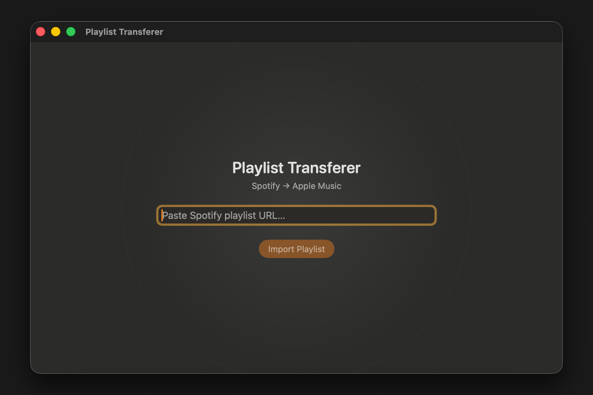

# Spotify -> macOS Music Playlist Transferer

Transfers Spotify playlists into the macOS Music app by fuzzy-matching tracks against your local library.

## How it works

Paste a Spotify playlist URL into the app and it will:

- Fetch all tracks from the Spotify playlist
- Scan your local Music library
- Fuzzy-match tracks by title and artist
- Create a playlist inside a **Spotify** folder in the Music app
- Report matched tracks, not-found tracks, and low-confidence matches to verify manually

---

## Architecture

The app has two components:

- **SwiftUI frontend** (`swift-app/`) — native macOS GUI built with SwiftUI
- **Python backend** (`backend/`) — handles Spotify API calls, fuzzy matching, and Music app control via AppleScript

The Swift app launches the Python backend as a subprocess on startup and communicates with it over a local HTTP connection. When distributed as a standalone `.app`, the Python backend is bundled as a self-contained binary using PyInstaller — no Python installation required on the target machine.

---

## Using the app

### Download

Grab the latest `PlaylistTransferer.app` from [Releases](https://github.com/hlavamir/PlaylistTransferer/releases) and drag it to your Applications folder.

**First launch:** macOS will block the app since it is not notarized. Right-click -> Open to bypass Gatekeeper, or run once:
```bash
xattr -cr PlaylistTransferer.app
```

### Credentials setup

On first launch the Settings window opens automatically:

1. Go to [developer.spotify.com/dashboard](https://developer.spotify.com/dashboard) and log in
2. Click **Create app** — any name and description is fine
3. Set **Redirect URI** to `https://google.com` and save
4. Copy your **Client ID** and **Client Secret** into the Settings window

Credentials are saved to `~/.playlist-transferer/.env` and reused on every subsequent launch.

### Spotify authorisation

After saving credentials, authorise the app with Spotify once:

1. Click **Open Spotify Authorization Page** in Settings — your browser opens
2. Click **Agree** — the browser redirects to Google (that is expected)
3. Copy the full URL from the address bar (e.g. `https://www.google.com/?code=AQ...`)
4. Paste it into the **Authorization Redirect URL** field and click **Save**

The token is cached at `~/.playlist-transferer/.spotify-token` and reused on future runs.

---

## Building from source

### Prerequisites

- macOS 13 or later
- Xcode Command Line Tools (`xcode-select --install`)
- [pyenv](https://github.com/pyenv/pyenv) with Python 3.12 installed

### Setup

```bash
cd backend
python3 -m venv .venv
.venv/bin/pip install -r requirements.txt
```

### Build the app

```bash
./build-app.sh
```

This will:
1. Kill any running backend instance
2. Clean previous build artifacts
3. Bundle the Python backend into a single binary with PyInstaller
4. Build the Swift frontend in release mode
5. Assemble `dist/PlaylistTransferer.app`

### Run from source (development)

```bash
cd swift-app
swift run
```

The Swift app will automatically find and launch `backend/.venv/bin/python3` with `backend/backend.py`.

---

## Support the App 🍺
Did the app save you some time and effort? Would you like to support any future development? Consider buying me a beer (or a coffee).

→ https://ko-fi.com/zeys_hlvmr

Thanks! ❤️

---

## License

MIT — see [LICENSE](LICENSE).

---

*This project is not affiliated with or endorsed by Spotify or Apple.*
